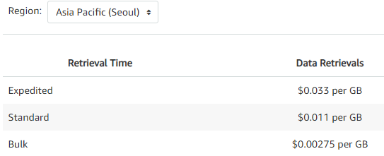
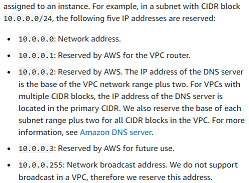
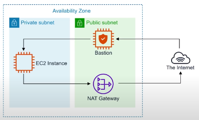
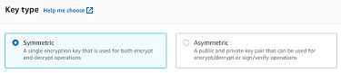
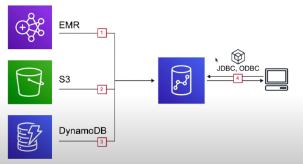
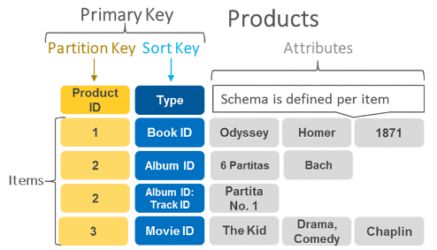

# Doe's awsGuide

### 이 repository 는 :

AWS 전반의 공부를 기록으로 남기고자 만들었습니다.\
AWS Certified Solutions Architect 시험을 위해 만들었습니다.

### Studied from :

[AWS Certified Solutions Architect - Associate 2020](https://www.youtube.com/watch?v=Ia-UEYYR44s&t=299s)

[Linux Academy AWS Essentials](https://www.youtube.com/watch?v=BDBvHOaaKHo&list=PLv2a_5pNAko0Mijc6mnv04xeOut443Wnk)

[Pythoholic AWS Certified Solutions Architect Associate 2021](https://www.youtube.com/watch?v=rXyyDMIC4PQ&list=PLiH9_MU-6RjI9gdFqmvUfKRfw_zRxIb6o)

### 복습, 암기 CheckList :
<details>
<summary>
</summary>
<br/>

배운 내용이 너무 많아 잠시 점검 복습이 필요하다 느꼈습니다.   
내용의 추가, 수정이 조금 줄겠지만 복습한 내용조차 기록하도록 하겠습니다. ㅋㅋ   
이것은 조금 개인적인 공부니까 가이드에는 부적절해서 나중에 아마 삭제할 것 같아요...   
  * 21/5/29 
    * 암기가 부족한 내용
      * Archive Retrieval Options
      * Bucket policy, acl, crr, event notification 
    * S3 까지     
      line 232/2493
  * 21/5/30
    * 암기가 부족한 내용
      * AWS AD, VPC, Customer gateway, VPC gateway, VPC cloudHub, Nacl 숫자가 작은 것이 더 우선순위, 
        Interface endpoints, gateway endpoints, transitive peering, flow logs, KMS symetric, asymetric, access keys, route53 logging, 
    * AWS STS 까지    
      line 700/2493
  * 21/5/31
    * 암기가 부족한 내용
      * Cognito sync, user pools, identity pools, DNS top/second level domain, SOA, failover routing, multivalue awnser routing,
      route53 logging, ec2 accelerated optimized, ec2 partition, dedicated instance, systems manager -> patch manager, asg health check
      ASG Lifecycle hooks, load balancers in general, sticky sessions are from cookies, cross zone load balancing, 
    * AWS EC2 까지   
      line 1210/2493
  * 21/6/1
    * 암기가 부족한 내용
      * instance store, ebs optimizes, ebs lifecycle, cloudfront seer, cloudfront invalidation, lambda@edge view/origin, WAF in general, rds backups, read replicas can be multi regional, aurora rds distribution, aurora fast ddl, redshift is single az, mpp, leader/compute nodes, redshift enhanced vpc routing, what is the meaning of multi master in dynamoDB?, LSI, GSI, DAX
    * DynamoDB 까지   
      line 1761/2493
  * 21/6/6
    * 암기가 부족한 내용
      * cloudformation templates, nestedstacks, cloudwatch api, cloudwatch agent, managed/data events, cloudtrail, lambda async, lambda /tmp, sqs consumer must delete message, sqs standard/fifo,      
      api gateway throttling, api gateway resource policy, api gateway access control, 
    * Storage gateway 까지
      line 2359/2493
</details>
<br>
  
      
* ## [시험](https://aws.amazon.com/ko/certification/certified-solutions-architect-associate/)
  * ### [내용 (2021년 기준. Outdated 할 수 있으니 위 주소에서 확인 바랍니다.)](https://d1.awsstatic.com/ko_KR/training-and-certification/docs-sa-assoc/AWS-Certified-Solutions-Architect-Associate_Exam-Guide.pdf)
    * 탄력적 아키텍처 설계 30%
    * 고성능 아키텍처 설계 28%
    * 안전한 애플리케이션 및 아키텍처 설계 24%
    * 비용-최적화된 아키텍처 설계 18%
  * ### 문제
    * 단일 선택
    * 다중 선택
  * ### 합격
    * 720/1000 (2021년 기준. 이수자의 %에 따라 다를 수 있습니다.)

### 연습문제 :

Udemy SSA-C02 ([한국어](https://www.udemy.com/course/aws-saa-c02/) /[영어](https://www.udemy.com/course/aws-certified-solutions-architect-associate-amazon-practice-exams-saa-c02/))

[Whizlabs (영어)](https://www.whizlabs.com/aws-solutions-architect-associate/practice-tests/)

* ## S3 (Simple Storage Service)
  * ### Object based storage service
    * data as objects 
    * opposed to other storage architectures such as
      * file systems
      * block storage
  * ### Serverless storage in cloud
  * ### Unlimited storage
  * ### No worries for infrastructure
  * ### Upload Success returns HTTP 200
  * ### S3 Object
    * Like files / objects
    * 0 Bytes ~ 5 Terabytes
    * Contains data
      * Owner
      * Last Modified
      * Key : Name of object
      * Value : data sequence of bytes
      * Version ID : Version of the object when enabled
      * Metadata : Additional information
  * ### S3 Bucket
    * Hold S3 Objects
    * Universal namespace (Names need to be unique)
    * Features
      * Bucket Versioning
      * Encryption
      * Server access logging
      * Cloud Trail data events
      * Transfer acceleration
      * Object Lock
        * Write once, read many
  * ### [Logging](https://docs.aws.amazon.com/AmazonS3/latest/userguide/logging-with-S3.html)
    * Server access logging (requests)
    * Cloud Trail data events (user/role/API)
    * Logging per request can be turned on a bucket
    * Logs are generated and saved in a different bucket
    * Different account logging is possible
  * ### Storage Class
    * Standard (default)
      * Fast
      * 99.99% Availability
      * 11 9's Durability
      * Replicated at least three Availability Zone (AZ)
    * Intelligent Tiering
      * Uses ML
      * Data is moved to most cost effective tier
      * No performance impact or overhead
    * Standard Infrequently Accessed (IA)
      * Still Fast
      * 50% Cheaper than Standard
      * Reduced Availability
        * Access files once a month
        * Additional retrieval fee if accessed more
    * One Zone IA
      * Still Fast
      * 20% Cheaper than Standard IA
      * Reduced Availability 99.5%
        * Retrieval fee
      * Reduced Durability (Data could get destroyed)
    * Glacier
      * Long term cold storage
      * Very Cheap
      * Minutes to Hours for Retrieval
    * Glacier Deep Archive
      * Lowest Cost
      * 12 Hours for Retrieval
      * Must be restored before changing to another tier
  * ### S3 Glacier
    * #### Vault
      * Container for storing archives
      * Contains [Metadata](https://docs.aws.amazon.com/amazonglacier/latest/dev/retrieving-vault-info.html)
      * Async download
        * Can create SNS when finished
    * #### Archive  
      * Object that you store in a vault
      * Archive ID (Used to retrieve data)
      * #### Archive Retrieval Options
        * Expedited
          * 1~5 minutes
        * Standard
          * 3~5 hours
        * Bulk
          * 5~12 hours
        * 
  * ### Security
    * All new buckets are PRIVATE by default
    * Access Control
      * Access Control Lists (ACL)
        * Legacy feature (Not Deprecated)
        * Simple
      * Bucket Policies
        * JSON
        * AWS Policy Generator
  * ### Encryption
    * Transit
      * Local Host <-> S3 achieved via SSL/TLS   
        (Secure Socket Layer, Transport Layer Security)
    * Server Side Encryption (SSE) (Encryption At Rest)
      * S3 Managed Keys (Amazon Manages all Keys)
        * SSE-AES (AES-256 algorithm)
        * SSE-KMS (AWS Key Management AWS and YOU manage keys)
        * SSE-C (Customer Provided key, AWS and YOU manage keys)
    * Client Side Encryption (CSE)
      * You Encrypt files before upload
    * Existing files before Encryption on is not Encrypted
  * ### [Data Consistency](https://aws.amazon.com/ko/s3/consistency/)
    * All GET, PUT, DELETE, LIST operations
      * Strong Read After Write Consistency
      * Able to read immediately after writing
      * 21년도 이후 S3는 strong read and write consistency
  * ### Cross Region Replication (CRR)
    * Automatic replication to other regions
    * Higher durability
    * Disaster recovery
    * Versioning must be on both source and destination
    * Can CRR to other accounts
  * ### Versioning
    * Once enabled, cannot be disabled. Can be suspended
    * Full Integration with S3 Lifecycle rules
    * Delete request will put a [delete marker](https://docs.aws.amazon.com/AmazonS3/latest/userguide/DeleteMarker.html)
      on the latest version
      * Remove the delete marker to restore deleted data  
    * Previous version becomes latest if latest version is deleted
    * Version ID can be NULL if object created before Versioning on
    * Properties like public is not inherited between versions
  * ### Lifecycle Management
    * Automate moving storage class(Tier), or delete
    * Can be used with Versioning
    * Can be applied to current or previous versions
    * [Can be used to abort multipart uploads](https://docs.aws.amazon.com/AmazonS3/latest/userguide/lifecycle-configuration-examples.html#lc-expire-mpu)  
    * Per-request fee
    * Minimum wait duration is 30 days
  * ### [Event Notifications](https://docs.aws.amazon.com/AmazonS3/latest/userguide/NotificationHowTo.html)
    * Notification when a specific action happens in bucket
    * Can add prefix, Suffix to specify object  
    * #### Invocation
      * Create
      * Delete
      * Restore
      * Replicate
    * #### Destination
      * SNS
      * SQS
      * Lambda
  * ### Transfer Acceleration
    * Uses CloudFront Edge Locations
    * User uploads to distinct URL from edge Location
    * Edge Location data is routed to S3 by AWS backbone network.
  * ### Presigned URLs
    * Generated URL
    * Temporary access to Object for Upload or Download
    * Access to Private Objects
    * Created by AWS CLI/SDK
    * Expire date
    * Both Download/[Upload](https://docs.aws.amazon.com/autoscaling/ec2/userguide/schedule_time.html) is possible
  * ### Retrieve object in parts
    * You can get a range of bytes
    * Specify "range" in HTTP header GET request
  * ### Upload object in parts
    * Up to 5 GB can be uploaded with PUT
    * Use multipart upload more than 5 GB
  * ### MFA Delete
    * Must provide MFA token/code to delete
    * Enable Conditions
      * By AWS CLI
      * Versioning on
    * Only Root User can delete
  * ### AWS CLI
    * ls
      * return all buckets `aws s3 ls`
      * return bucket objects `aws s3 ls s3://bucketName` 
      * return directory objects `aws s3 ls s3://bucketName/folderName` 
    * cp
      * download object to a.jpg    
        `aws s3 cp s3://bucketName/folderName/objectName.jpg ~/Desktop/a.jpg`
      * upload a.jpg to object   
        `aws s3 cp ~/Desktop/a.jpg s3://bucketName/folderName/objectName.jpg`
    * presign
      * creates a presigned url   
        `aws s3 presign s3://bucketName/folderName/objectName.jpg --expires-in 300`
  * ### [S3/S3 Glacier Select](https://aws.amazon.com/blogs/aws/s3-glacier-select/)
    * Use queries on S3
    * Cheaper, Faster
    * Does not need to retrieve data before query
  
* ## Snowball
  * ### Petabyte date transfer service (Use multiple snowballs)
  * ### AWS data to physical computer
    * Import and export
  * ### Low cost
    * Costs thousands of dollars to transfer 100 TB in high speed internet
    * Reduce cost by 1/5th
  * ### Speed
    * Takes 100 days to download 100 TB over high speed internet
    * Reduce time by less than a week
  * ### Features
    * E-link display (Shipping information)
    * Tamper/Weather proof
    * Data encrypted (256-bit encryption)
    * Trusted Platform Module(TPM)
      * Chip that stores RSA encryption keys for hardware authentication
      * Specific to the host system
    * Data transfers must be completed in 90 days
    * Can import and Export S3
  * ### Size
      * 50 TB (42 TB usable)
      * 80 TB (72 TB usable)

* ## Snowball Edge
  * ### Similar to snowball
  * ### More storage
  * ### Local processing
  * ### Petabyte data transfer service
  * ### Features
    * LCD Display (Shipping information / functionality)
    * Local processing
    * Edge-computing workloads
    * Can use in a cluster of 5 ~ 10 devices
  * ### Optimization Options
    * Storage optimized (24 vCPUs)
    * Compute optimized (54 vCPUs)
    * GPU optimized (54 vCPUs)
  * Size
    * 100 TB (83 of usable)
    * 100 TB Clustered (45 TB per node)
  
* ## Snowmobile
  * ### 45 foot long shipping container
  * ### Pulled by semi-trailer truck
  * ### Exabyte data transfer service
  * ### 100 PB per Snowmobile
  * AWS personnel will help connect, and when data transfer is complete, they'll drive it back to AWS and import to S3
  * ### Security
    * GPS tracking
    * Alarm monitoring
    * 24/7 video surveillance
    * Escort security vehicle while transit (Optional)

* ## [AWS Directory Service](https://docs.aws.amazon.com/directoryservice/latest/admin-guide/what_is.html)
  * ### Used for Microsoft Active Directory (AD)
    * Directory service run on Microsoft Windows Server/Windows File Server(FSx)
    * Manage permissions and control access to network resources
    * Manage users/groups/devices/administrators
  * ### Connect over VPN/Direct Connect
  * ### Options
    * #### Directory Service for Micorsoft AD
      * When you need an actual AD in AWS Cloud
    * #### AD connector
      * When you need on premise AD to authenticate AWS
    * #### Simple AD
      * Low cost, low scale basic AD
    * #### Cognito
      * For SaaS
  
* ## Virtual Private Cloud (VPC)
  * 
  * ### Key Features
    * Region Specific
    * Do not span regions
    * Every region has default VPC
    * 200 subnets per VPC
    * Uses IPv4 ClDR Block
    * Can add IPv6 ClDR Block
    * Can add additional CIDR Blocks to expand VPC
    * DNS hostnames (VPC option)
      * Domain Name System (DNS)
      * Uniquely names a computer
      * DNS server connects hostnames to IP address
      * Off by default
      * EC2 DNS
        * 
    
  * ### Default VPC
    * Default VPC in every region
    * Can immediately deploy ec2
    * The first four IP address and the last IP in each subnet CIDR is reserved by AWS  
      * Network address
      * Reserved for VPC router
      * Reserved for DNS server
      * Reserved for future use
      * Network broadcast but not supported
      * 
    * Features
      * Size /16 IPv4 [CIDR](https://www.youtube.com/watch?v=z07HTSzzp3o) (ex: 172.31.0.0/16)
      * Creates Size /20 default subnet in every AZ
      * Creates Internet Gateway
      * Creates default security group
      * Creates default network access control list (NACL)
      * Associate to default [DHCP](https://www.youtube.com/watch?v=e6-TaH5bkjo)
      * VPC creation automatically has route table
      
  * ### 0.0.0.0/0
    * All possible IP addresses
    * [Internet Gateway](https://www.youtube.com/watch?v=pAOrBxZ7584) (IGW)
    * Allow All Internet Access
      * Security Groups Inbound Rules
      * NACL Inbound, Outbound Rules
    
  * ### Components
    
    * #### Internet Gateway (IGW)
      * Allows VPC access to the Internet
      * Provide a target in VPC route tables
      * Performs network address translation ([NAT](https://www.youtube.com/watch?v=FTUV0t6JaDA))
        * Only Addresses with public IPv4
      * To connect to the Internet
        * Add route table
        * Route that table to Internet Gateway
        * Set destination to 0.0.0.0/0
    
    * #### [Egress-only Internet Gateway](https://docs.aws.amazon.com/vpc/latest/userguide/egress-only-internet-gateway.html)
      * Connects to the Internet via IPv6
      * Prevents the Internet connection to server
      * One way connection
      * Stateful
        * All requests from EC2 will go back to EC2
      
    * #### [Virtual Private Gateway (VPN Gateway)](https://www.youtube.com/watch?v=3j1MLlgc5Eg)
      * Connects a on premise private IP to connect to AWS VPC
      * Customer Gateway
        * Connects on premise
      * Virtual Private Gateway
        * Connects AWS VPC
      * VPN CloudHub
        * Create virtual private gateway
        * Create multiple customer gateways
          * Each with unique BGP,ASN
          * Border Gateway Protocol (BGP)
          * Autonomous System Number (ASN)
      * Policy-based VPN
        * If using one or more pairs of security, when new connections with new security associations arrive   
        VPN might drop existing connections resulting in packet loss
      
    * #### [Route Table](https://www.youtube.com/watch?v=GrfOsWUVCfg)
      * Determines where network traffic is directed
      * Each Subnet must have a route table
      * Any subnets without route table will get associated with Main route table automatically  
      * One(Route Table) to Many(Subnet)
      * Can have multiple route tables in a VPC
      * Connect traffic with
        * Internet Gateways
        * Instance
        * Nat Gateway
        * Virtual Private Gateway
        * From Subnet Associations
      
    * #### Bastion / Jumpbox
      * 
      * EC2 instances for security
      * Help gain access to EC2 in private Subnet
      * Not for a internet proxy    
      * Via SSH or RCP
      * NAT Gateways should not be used as Bastions
      * NAT Gateways intentions is for security updates
      * [Systems Manager's Session Manager](https://www.youtube.com/watch?v=TiaxgThfTRc) can replace Bastion
      
    * #### Security Groups (SG) Stateful
      * Firewall for EC2 instance
      * Associated with EC2 instances
      * Protocol / Port security
      * Allows IP range / Specific IP / Security group
      * Inbound and Outbound rules
        * Statefull (Inbound allowed is also Outbound allowed)
        * Traffic allowed in is also allowed out  
        * All inbound traffic blocked by default
        * All outbound traffic allowed by default  
      * No Defy rules, only access rules
      * Many(Security Group) to Many(EC2(Multiple Subnets possible))
      * Rules are permissive (Permit overrides deny)
      * Limits
        * Upto 10,000 (default 2,500) SG per Region
        * 60 inbound rules and 60 outbound rules per SG
        * Upto 16 (default 5) SG per Elastic Network Interface (ENI)
      
    * #### Public Subnets
      
    * #### Private Subnets
      * Fixed MAC address
      
    * #### Network Address Translation (NAT) Gateway
      * Remapping one IP address to another
      * Help gain outbound internet access for private subnet
      * Remap private IP
      * NAT must to be allocated a Private and a Elastic IP  
      * NAT does not support IPv6  
      * Solve same IP addresses (Conflicting network address)
      * Redundant inside an AZ (AWS manages it/ no EC2 fails)
      * 1 NAT Gateway per 1 Subnet
      * Starts at 5 Gbps and scales up to 45 Gbps
      * Preferred than NAT Instance
      * Route Tables for the NAT Gateway must be updated
      * Peered VPC cannot share NAT Gateway
      * In order to connect to the internet with NAT while using a private subnet for EC2
        * Put the NAT gateway in a public subnet
        * Place a routing table in the public subnet
        * Route that traffic to internet gateway
        * Put your instances in a private subnet
        * Put a routing table at the private subnet
        * Route traffic to NAT gateway
      
    * #### Customer Gateway
      
    * #### [VPC Endpoints](https://www.youtube.com/watch?v=MPaxxOsjOos)
      * Private connect VPC to other AWS services
      * No need for Internet Gateway / NAT / VPN / AWS direct connect
      * Instance do not require public IP
      * Traffic does not leave the AWS network
      * Secure communication
      * Fast / No bandwidth constraints
      * Types
        * Interface Endpoints
          * In private subnet
          * Uses Elastic Network Interfaces
          * Private IP address
          * Powered by AWS PrivateLink
          * Supports many AWS services  
          * Costs Money
          * Add policies
            * May restrict certain S3
        * Gateway Endpoints
          * Connect From Route table
          * Supports only two services
            * S3
            * Dynamo DB
          * Free
      
    * #### [VPC Peering](https://www.youtube.com/watch?v=w-5lSvqSkjs)
      * Connecting VPC with VPC
      * Direct network route
      * Connection by private IP address
      * Peered VPC behave like they are on the same network
      * Can peer different AWS account VPC
      * Can peer different region VPC
      * No Transitive Peering
        * One(VPC) to One(VPC)
        * Signal Traffic/Peering must be direct
        * Use transit gateway instead  
        * 
      * Peering uses Star Configuration
        * 
        * 1 Central VPC
        * 4 Other VPC
      * No Overlapping CIDR Blocks
      * Peered VPC cannot share NAT gateways
      * To send traffic from instance to instance in peer
        * Add route table associated with peer subnet
    
    * #### VPC Flow Logs
      * Log in CloudWatch Logs or S3   
      * Capture IP traffic information
      * Within Network Interface in VPC
      * Cannot be tagged like other AWS resources
      * Cannot Change configuration after creation 
      * Cannot enable peered VPC flow logs unless in same account  
      * Monitor Levels  
        * VPC
        * Subnets
        * Network Interface
      * Log
        * version
        * account-id
        * interface-id (ID of network interface)
        * srcaddr (Source IPv4 or IPv6)
        * dstaddr (Destination IPv4 or IPv6)
        * srcport (Source port of traffic)
        * dstport (Destination port of traffic)
      * Not Logged
        * Traffic to AWS DNS Servers
        * Windows license activation traffic for instances
        * Instance metadata address traffic
        * DHCP traffic
        * Any traffic to reserved IP address of default VPC router
      
    * #### [Direct Connect](https://www.youtube.com/watch?v=jEcl5H8Ow_8)
      * Establish a dedicated network from Office to AWS
      * Very fast network
      * Private connectivity
      * Lower Bandwidth 50 M ~ 500 M
      * Higher Bandwidth 1 GB ~ 10 GB
      * Help reduce network cost for high traffic
      * More consistent network than internet
      
    * #### [Software site-to-site connect](https://docs.aws.amazon.com/whitepapers/latest/aws-vpc-connectivity-options/software-site-to-site-vpn.html)
      * Connect on-premise VPC with AWS VPC
      * Supports [IPSEC](https://www.youtube.com/watch?v=-JrXllTuI2s) 
        * Encrypt data between internet transportation
    
    * #### [Network Access Control List (NACL)](https://www.youtube.com/watch?v=vJzHn24TNQE)
      * Firewall subnet traffic
      * First Layer of security  
      * VPC is automatically given default NACL
        * Default NACL will accept all traffic from VPC
        * Custom created NACL will deny all traffic
      * Subnets must have a NACL  
      * One(NACL) to Many(Subnets)
      * Allow or defy traffic (Security groups only allow)
      * Inbound or outbound rules (Like security groups)
        * All inbound rules are not allowed to outbound by default   
          unlike Security groups (Stateless)
      * NACL needs to make Ephemeral ports open
        * Ports for AWS resources   
          
      * Can block a single IP (Security groups can't) 
      * Order of evaluation Rule number #
        * Lower is higher priority
        * 10 to 100 increments recommended
        * The * Rule is the highest rule
      * Example
        * Malicious hacker IP block
        * SSH block
  
* ## AWS Systems Manager
  * ### Sessions manager
    * Access EC2 without bastion or SSL
  * ### [Parameter Store](https://www.youtube.com/watch?v=zxi3M_rIE2k)
    * Store parameters and access by code
    * Use KMS with Parameter Store
    * Can organize and bulk with paths
  
* ## AWS Key Management Service (KMS)
  * ### Key Types
    * #### Symmetric key
      * Uses same key for encrypt/decrypt
    * #### Asymmetric key  
      * Uses different key for encrypt/decrypt
    *   
    * #### AWS Managed Keys
    * #### Customer Managed Keys
    * 
    
  * ### KMS is region specific  
  * ### All data is encrypted at rest
  * ### Define IAM Users/Roles that manage/use keys
  * ### Can disable and re-enable keys
  * ### Rotate keys  
    * AWS automatically encrypt/decrypt using the rotated key
  * ### Logs uses CloudTrail
  * ### Need to wait time periods to remove
      

* ## Identity Access Management (IAM)
  
  * ### Manage access of AWS users and resources
  * ### Universal system (All AZ)
  * ### Free service
  * ### IAM Identities
    * #### IAM Users
      * End users using aws sdk or cli
    * #### IAM Groups
      * Group IAM Users
      * Shared permissions
      * Example : Administrators/Developers/Auditors
    * #### IAM Roles
      * Associate permissions to a Role
      * Give Roles to Users or Groups 
      * Roles can also be attached to AWS Resources
    
  * ### IAM Policies
    * #### JSON
      * Version (ex: 2012-10-17)
      * Statement (Container for multiple policy elements)
      * Sid (Optional, ways to name statements)
      * Effect (Allow/Deny)
      * Principal (Account/user/role/fedrated user)
      * Action (List of actions policy allows or denies)
      * Resource (Resource where action applies)
      * Conditional (Optional,circumstances when policy applies)
      * 
    * Grants permission to Identities
    * Policies are attached to User/Group/Roles
    * Types
      * #### Managed Policies
        * Policy managed by AWS
        * Cannot be edited
        * Labeled with orange box
      * #### Customer Managed Policies
        * A policy created by a customer
        * Can be edited
        * No symbol
      * #### Inline Policies
        * Directly attached to user / resource
      * #### [Account Password Policy](https://docs.aws.amazon.com/IAM/latest/UserGuide/id_credentials_passwords_account-policy.html)
        * Rotate passwords to update after X days
        * Set minimum requirements
    
  * ### Access keys
    * Allow users use CLI/SDK
    * Cannot access console 
    * Two Access keys per user
    * Can make active/inactive
    * Only shown once, if lost delete, recreate
  
  * ### Multi Factor authentication (MFA)
    * Can be turned on per user
    * User can turn on themselves
    * Admin can not enforce MFA
    * Admin can create policy requiring MFA for resources
    * Should set MFA for Root 
    * Type
      * #### Virtual MFA device
      * #### U2F security key
      * #### Other hardware MFA device
  
* ## AWS Security Token Service (STS)
  * ### Use SDK/CLI to get
    * AWS access key
    * Secret access key
    * Security token
  * ### Use SDK/CLI to let
    * Users to assume role
    * Generate Federated credentials for IAM Users
    * Request temporary access
    * Not for Roles, but for Users
  * ### Temporary access
    * Short term use
    * Active for few minutes to hours
  * ### When to use?
    * Temporary worker
    * Roles for Cross Account Access
    * Roles for EC2
      * Access resource without embedding credentials
  * ### Logging
    * #### CloudTrail not CloudWatch!
  * ### [STS API](https://docs.aws.amazon.com/STS/latest/APIReference/API_Operations.html)
    * Send api to
      * https://sts.amazonaws.com/
    * #### AssumeRole
      * Returns temporary credentials
    * #### AssumeRoleWithSAML
      * Returns temporary credentials 
      * Authenticated by SAML
    * #### AssumeRoleWithWebIdentity
      * Returns temporary credentials
      * Authenticated by web identity provider
    * #### DecodeAuthorizationMessage
      * Decode additional information about authorization status
    * #### GetAccessKeyInfo
      * Get AWS account ID number from Access key
    * #### GetCallerIdentity
      * Returns Account,Arn,UserId of the caller
    * #### GetFederationToken
      * Return set of credentials
      * Authenticated by federated user  
      * Access key, secret access key, security token
    * #### GetSessionToken
      * Return set of credentials
      * From AWS account or IAM User
      * Access key, secret access key, security token

  
* ## Amazon Cognito
  * ### Web Identity Federation
    * To exchange identity and security information between IdP and application
    
  * ### Identity Provider (IdP)  
    * Trusted provider for authentication (Facebook, Google ...)
    
  * ### IdP methods
    * Security Assertion Markup Language (SAML) (Single Sign On SSO)
    * OpenID Connect (OIDC) (OAuth)
    
  * ### Types
    * #### Cognito User Pools
      * User directory with authentication to IdP to grant app access
      * User Pools
        * Directories to manage the actions such as
          * Sign in
          * Sign up
          * Account recovery
          * Account confirmation
      * Sign by User Pool or IdP
      * Uses JWT to persist authentication
      * Settings
        * Allow sign in with email/phone/username
        * Choose signup requirements
        * Choose password requirements
        * Apply MFA
        * Trigger custom logs, Lambdas
    
    * #### Cognito Identity Pools (Federated identity)
      * Temporary credentials for users to access AWS Services
      
    * #### Cognito Sync
      * One line of code
      * Syncs user data and preferences across devices
      * Push synchronization to push updates and sync data
      * Uses Simple Notification services (SNS)
      * Sends Identity pools to sync data
  
  
* ## AWS Command Line Interface (CLI)
  * ### Interact with AWS via command line
  * ### Important CLI flags
    * --profile : switch between AWS accounts
    * --output : changes output between json, table and text
  * ### AWS User must have Programmatic Access
    * Access Key ID, Secret Access Key (AWS Credentials)
    * Store credentials in user home (~/.aws/credentials)
    * Multiple credentials can be managed by profiles  
      ```
      [ProfileName]   
      aws_access_key_id=   
      aws_secret_access_key=
      ```
    * 
  
* ## AWS Software Development Kit (SDK)
  * ### Set of tools and libraries to use AWS in apps for specific language
  * ### AWS User must have Programmatic Access
    * Access Key ID, Secret Access Key (AWS Credentials)
    * Store credentials in user home (~/.aws/credentials)  
    * Multiple credentials can be managed by profiles
    

* ## Domain Name System (DNS)
  * ### Changes Domain name (google.com) -> IP address (142.250.196.132)
  * ### Internet Protocol (IP)
    * #### Uniquely identifies each computer for communication
    * #### Internet Protocol Version 4 (IPv4)
      * Address space is 32 Bits
      * Currently running out of space
    * #### Internet Protocol Version 6 (IPv6)
      * Address space is 128 Bits
  * ### Domain Levels
    * #### Top Level Domain
      * Last word within a domain name (.com)
      * Controlled by Internet Assigned Numbers Authority (IANA)
    * #### Second Level Domain
      * Second word within a domain name (.co.kr : .co)
  * ### Start of Authority (SOA)
    * Every Domain must have an SOA record
    * Information about the domain
    * #### Structure
      * NAME : name of zone
      * IN : zone class
      * SOA : start of authority
      * NNAME : master name server of zone
      * RNAME : admin email of zone
      * SERIAL : serial number for zone
      * REFRESH : ...
      * RETRY : ...
      * EXPIRE : ...
      * TTL : ...
  * ### Address Records (A Records)
    * Convert Domain name -> IP
  * ### Canonical Names (CNAME)
    * Convert Domain name -> Domain name
  * ### Name Server Records (NS Records)
    * Direct traffic to the DNS server containing DNS records
    * Multiple name servers are provided for redundancy
  * ### Time To Live (TTL)
    * Time that a DNS record gets cached
    * Time it takes to propagate across the internet
    * Measured in seconds under IPv4
  
* ## Route53
  * ### Domain name provider in AWS
  * ### Functionality
    * #### Register Domain
    * #### Create Records sets on a domain
    * #### Implement complex traffic flow (Blue/Green, Deploy, Failovers)
    * #### Monitor records via heath checks
    * #### Resolve VPC outside AWS
    
  * ### Traffic flow
    * Visual editor for routing config
    * Supports versioning
    * 50$ per policy record / month
    * Can use geoproximity routing
    
  * ### Record Set
    * #### www. , api. , blog. to A, AAAA, CNAME...
    * Alias
      * Always should use Alias because resources changes IP
      * Route traffic to specific AWS Resources
    * #### A to Alias
      * API Gateway
      * CloudFront
      * Elastic Beanstalk
      * All Load Balancers
      * Global Accelerator
      * S3 Static website
      * VPC Endpoint
    * #### A (Not by Alias)  
      * EC2 instance
    * #### AAAA to Alias
      * All Load Balancers
      * CloudFront
    * #### Cname (Not by Alias)
      * RDS
  * ### Routing Policy
    * #### Simple Routing
      * Default Policy
      * One(Record) to Many(IP)
      * Return all IP back to user in random order
      * User will be directed to random IP
    * #### Weighted Routing
      * Split traffic based on weights
      * Good for A/B testing
      * ex) 85(EC2 Stable) : 15(EC2 Test)
      * One(Routing Policy) to Many(Record Sets)
    * #### Geolocation Routing
      * Redirect Via Geolocation of request origin
      * ex) North America -> ALB US-NORTH-1
    * #### Geoproximity Routing
      * Redirect Via Geolocation but with Bias Value
      * Bias value expand or shrink size of geolocation
      * Can only be set by Traffic Flow
      * 
    * #### Latency Routing
      * Direct traffic based on latency
      * Based on region
      * Requires latency resource record for EC2 or ELB
      * ex) 100ms(ALB WEST-1) : 12ms(ALB EAST-1)
    * #### Failover Routing
      * If Primary fails Redirects to Secondary
      * Can check via Health Checks
    * #### Multivalue answer Routing
      * Just like Simple Routing
      * Only difference is heath check
      * Returns IPs only if healthy
    
  * ### Health Checks
    * #### Checks every 30s by default
    * #### Can be reduced to 10s
    * #### Can Initial a failover if unhealthy
    * #### CloudWatch Alarm can be created
    * #### Type
      * Endpoint
      * Status of other health checks
      * State of CloudWatch Alarm
      * 

  * ### [Logging](https://docs.aws.amazon.com/Route53/latest/DeveloperGuide/monitoring-overview.html)
    * #### CloudWatch
      * HealthCheck to CloudWatch alarms
      * Resolver endpoints statistics to cloudWatch
      * Public hosted zones
    * #### [CloudTrail](https://docs.aws.amazon.com/Route53/latest/DeveloperGuide/logging-using-cloudtrail.html)
      * Request IP, who, when, additional details to S3
    
  * ### Route 53 Resolver
    * #### On premise connect with route 53
    * #### Regional service that route DNS between VPC and your network
    * #### Inbound(To VPC), Outbound(From VPC), Inbound and Outbound
    * #### DNS Resolution for Hybrid Environments (On Premise with Cloud)
  
* ## Elastic Compute Cloud (EC2)
  * ### Choose OS, Storage, Memory, Network Throughput
  * ### Resizable computing capacity
  * ### Everything on AWS uses EC2 instance underneath
  * ### Networking
    * #### Enable Auto-assign public IP
    * #### Enable elastic-IP for a fixed IP  
    * #### [May enhance network by](https://docs.aws.amazon.com/AWSEC2/latest/UserGuide/enhanced-networking-ena.html)
        * Elastic Network Adapter (ENA)
        * Code for Ubuntu   
        ```modify-instance-attribute --instance-id instance_id --ena-support```
  * ### Instance Types
    * #### General Purpose
      * Balance of memory, compute and network
      * Use-cases : web servers and code repositories
    * #### Compute Optimized
      * High performance processor
      * Use-cases : Scientific modeling, gaming servers and ad server engines
    * #### Memory Optimized
      * Fast performance for workloads and large data sets in memory
      * Use-cases : In-memory caches, in-memory databases, real time big data analytics
    * #### Accelerated Optimized
      * Hardware accelerators, co-processors
      * Use-cases : Machine learning, compute-finance, speech recognition
    * #### Storage Optimized
      * High sequential read and write to large data sets on local storage
      * Use-cases : NoSQL, in-memory/transactional databases, data warehousing
  * ### Instance Sizes
    * #### EC2 Instance Sizes generally double in price and attributes
    * 
  * ### Instance Profile
    * Instead of embedding AWS credentials in Code
    * Let's instance have permission to access AWS services
    * Attach a IAM Role to an instance via Instance Profile
    * Always avoid unnecessary AWS credentials if possible
  * ### [Placement Groups](https://www.youtube.com/watch?v=-i1PfF4Jyuo)
    * #### Cannot be multi region
    * #### Cluster
      * Great performance, but has failure risk
      * Same rack, same AZ
      * Low latency, 10 Gbs bandwidth
      * If rack fails, all instance fails
      * Cannot be multi AZ  
      * 
    * #### Spread 
      * High availability, limited performance
      * Multi AZ  
      * Limited to 7 instance per AZ
      * EC2 on different physical hardware
      * Reduce simultaneous failure
      * For critical applications where each
      instance must be isolated from failure
      *   
    * #### Partition
      * Up to 7 partitions per AZ
      * Up to 100s of instances
      * Instances in a partition do not share
      rack with instances in another partition
      * EC2 metadata includes partition information
      * For HDFS, Cassandra, Kafka
      * 
  * ### UserData
    * Script that automatically run when launching EC2 instance
    * 
  * ### MetaData
    * Access information about EC2 via special url endpoint in EC2
    * curl http://169.254.169.254/latest/meta-data
    * Get information such as IPv4 address, instance type and more
    * Combind MetaData and UserData to automate AWS
  * ### Pricing Model
    * #### On-Demand
      * Default pricing
      * No up-front payment
      * No long-term payment
      * For short-term, spiky, unpredictable, experimental, first-time apps
    * #### [Spot Instances](https://www.youtube.com/watch?v=DI64Ol3dbAY)
      * Like hotels or planes, AWS offers vacant EC2
      * Save up to 90%
      * Instances can be terminated by AWS at anytime
      * If you terminate the instance you still will be charged for any hour it ran
      * Use-cases : Apps that can handle Interruptions, for non-critical background jobs
    * #### [Reserved Instances (RI)](https://www.youtube.com/watch?v=01uV-clWkow)
      * Pricing = Class offering X Terms X Payment options
      * Class offering
        * Standard
          * Save up to 75%
          * Cannot change Instance Attributes
        * Convertible
          * Save up to 54%
          * Can change Instance Attributes only higher or equal in value
      * Terms
        * 1 year to 3 year contract
        * The longer the cheaper
      * Payment options
        * All Upfront
        * Partial Upfront
        * No Upfront
        * The greater upfront the cheaper
      * Can re-sell Reserved Instances
    * #### Dedicated
      * Most expensive
      * Single Tenant instances with Isolated server
        * 
      * Offered in On-demand and Reserved(70% save)
      * Enterprises and Large Organizations may have security concerns
  
  * ### [Amazon Machine Images (AMI)](https://www.youtube.com/watch?v=kkdr8Av2cQQ)
    * #### EC2 into images to copy servers
      * Holds information such as
        * Root Volume
        * Operating system
        * Application Server
        * Application
        * Launch Permissions
        * Block device mapping
    * #### AMI is region specific
      * You can copy to another region via Copy AMI
    * #### AMI ID  
    * #### Use Systems Manager Patch Manager Automation to patch AMIs with security updates
    * #### Use LaunchConfigurations to update multiple instances with AMI
    * #### Snapshot does not save RAM data  
    * #### Selection
      * Region
      * Operating System
      * Architecture
      * Launch Permissions
      * Root Device Type/Volume
        * Instance Store
        * EBS
    * #### AMI marketplace
      * Community AMI
        * Free to use
      * Vendor AMI
        * Cost per hour
        * Security harden AMI such as CIS is popular
      * My AMI
    
  * ### VM import
    * #### On premise VM to EC2
    * #### EC2 to on premise VM
    
  * ### EC2 [Hibernate](https://www.youtube.com/watch?v=pA6On8Jczfo)
    * Save RAM data to EBS
    * Reload saved Ram content
    * No OS boot time  
    * Great for pre-warming instances  
    * Cannot enable hibernation after launched
      * Check before
    * Cannot enable hibernation on instance store volume
    
  * ### Auto Scaling Groups (ASG)
    * #### Group of EC2 for auto-scaling and management
    * #### Launch Configuration
      * Launch settings for new EC2 from ASG
      * Cannot be edited
        * Clone the existing configuration or create a new configuration
      * Launch Templates
        * Launch Configuration with versioning
        * AMI
        * Instance Type
        * Storage
        * Security groups
        * Key pair
    * #### Capacity settings
        * Min
        * Max
        * Desired Capacity
          * How much EC2 you want ideally
    * #### [ASG Health check](https://docs.aws.amazon.com/autoscaling/ec2/userguide/healthcheck.html)
      * EC2 Health Check
        * Based on EC2 Status Checks
          * stopping/stopped/shutting-down/terminated
        * If considered unhealthy, restarts EC2
      * ELB Health Check
        * If the load balancer reports unhealthy, restarts
        * If response not expected, restarts EC2
      * Custom Health Check
        * If not working as intended, change ec2 state as unhealthy
    * #### Health Check Grace Period
      * When new EC2 is created, wait this period before health check
      * 
    * #### Scaling policies
      * Scaling Out : Adding more Instances
      * Scaling In : Removing Instances
      * Scaling Up : Increase the EC2 Specs  
      * Scheduled scaling is also possible for traffic in specific time  
      * Types
        * Target Tracking Scaling Policy
          * Scale by
            * Average CPU Utilization
            * Average Network In
            * Average Network Out
            * Application Load balancer request count per target
        * Simple Scaling Policy (Deprecated 2021)
          * Scales when alarm is breached
          * Legacy, not recommended
        * Step Scaling Policy (Deprecated 2021)
          * Scales when alarm is breached
          * Escalates based on alarm
          * ex) All 2 instances if alarm value is 2
      * Can add SNS 
    * #### Termination policies
      *   
    * #### [LifeCycle Hooks](https://docs.aws.amazon.com/autoscaling/ec2/userguide/lifecycle-hooks.html)
      * Custom action to EC2 before/after termination/initialization
      * Changes the instance into a wait state
      * Wait period is 1 hour
    * #### Elastic Load Balancers(ELB) with ASG
      * ASG can be associated with ELB
      * If associated richer health checks are available
      * Associated indirectly via Target Groups
    
  * ### Elastic Load Balancer (ELB)
    * #### Locates in a VPC
    * #### Must have at least two AZs
    * #### Cannot go cross-region
    * #### SSL Certificate can be attached to any Types  
    * #### Rules of Traffic
      * ##### Listeners
        * Evaluate Traffic that matches the listeners port
        * Can attach SSL Certificate
      * ##### Rules
        * Rules will decide what ports go to what target Groups
        * Only for Application Load Balancer
      * ##### Target Groups
        * Not for Classic Load Balancer or Gateway Balancer
        * Instance
        * IP
        * Lambda
    * #### Types
      * ##### Classic Load Balancer
        * Listeners and EC2 is directly registered
        * Can balance HTTP, HTTPS, TCP(Not at the same time)
        * Can use Layer 7 sticky sessions and Layer 4 TCP  
        * Can perform Cross Zone Load Balancing  
        * CLB does not allow you to apply rules to listeners
        * CLB -> Listeners -> Registered Targets
        * Responds 504(Timeout) error if not responding
        
      * ##### Application Load Balancer
        * Listeners, Rules and Target Groups
        * Designed to balance HTTP and HTTPS traffic
        * Operate at Layer 7 [(OSI Model)](https://www.youtube.com/watch?v=Ilk7UXzV_Qc)
        * Can use Sticky sessions  
        * Request Routing
          * Add routing rules to listeners based on HTTP protocol
          * Based on
            * Host Header
            * Http header
            * Source IP
            * Http header method
            * Path
            * Query String
        * Web Application Firewall can be attached
        * Great for Web Applications!
        
      * ##### Network Load Balancer
        * Listeners and Target Groups
        * Designed to balance TCP/UDP
        * Operate at Layer 4 (OSI Model)
        * Can handle millions of requests per second
        * Extremely low latency
        * Cross Zone Load Balancing
        * Great for Multiplayer Video Games or when network performance is critical
      
    * #### Sticky Sessions
      * Specific user sessions goes to a specific EC2
      * All requests from that session are sent to the same EC2
      * Cookies are used to remember which EC2  
      * Can be used in 
        * Classic Load Balancer 
        * Application Load Balancer
      * Useful when specific information is stored in single instance
      
    * #### X-Forwarded-For (XFF) Header
      * When using Load Balancers users IPv4 addresses can be changed to Load Balancers IPv4
      * Use X-Forwarded-For header to get the IP address
      * 
      
    * #### Health Checks
      * Checks EC2 with HTTP(S)
      * Reports back as InService or OutOfService
      * ELB does not terminate(Kill) unhealthy instances (ASG does)
      * ELB just redirect traffic to healthy Instances unlike ASG
  
    * #### Cross-Zone Load Balancing
      * Distributes traffic evenly within Zones
      * Distributes traffic evenly in all Zones
      * Can not be used in Application load balancer  
      * 
      
    * #### [Connecting to internet](https://aws.amazon.com/premiumsupport/knowledge-center/public-load-balancer-private-ec2/?nc1=h_ls)
      * Change private subnets to public
    
    * #### Pricing
      * Time X Partial Time X Capacity Unit
      * Capacity Unit
        * Application Load Balancer(LCU)(EC2)
        * Network Load Balancer(NLCU)
        * Gateway Load Balancer(GLCU)
        * Classic Load Balancer(GB)
  
    * #### [Monitor](https://docs.aws.amazon.com/elasticloadbalancing/latest/application/load-balancer-monitoring.html)
      * CloudWatch metrics
      * Access logs (S3)
      * Request tracing (Track HTTP requests)
      * CloudTrail logs
  
* ## Elastic File System (EFS)
  * File storage service for EC2
  * Storage capacity grows up to petabytes
  * Storage shrinks automatically
  * Multiple EC2 in same VPC can mount a single EFS
  * EFS supports Network File System version 4 (NFSv4)  
  * EC2 needs NFSv4 to use EFS
  * Provides Read After Write Consistency  
  * EFS creates multiple mount targets/points in all VPC subnets
  * ### Settings
    * General Purpose
      * Latency sensitive
      * Web serving environments
      * Content management systems
      * Home directories, file serving
    * Max I/O 
      * Higher aggregate throughput per second
  * ### EFS supports two forms of encryption
    * #### Encryption of data at rest
      * EFS Encryption at rest can only be enabled at creation
    * #### Encryption of data in transit
      * Mount helper
      * Not an option during or after creation
  * EFS file sharing can be across multiple AZ EC2s 
  * ### On premise connection
    * AWS Direct connect
    * AWS VPN
  * 0.30 $ per GB / month

* ## [Savings Plan](https://www.youtube.com/watch?v=kOJCQfNStu8)
  * ### Types
    * #### Compute Savings Plan
      * Automatically apply to EC2/Fargate/Lambda
      * No matter of Size/AZ/Region/OS
      * Reduce up to 66%
    * #### EC2 Instances Savings Plan
      * Lower cost in exchange for commitment of usage
      * Specific families, region (ex) M5 usage in ap-southeast-2 )  
      * Can change within EC2 families, region  
      * Reduce up to 72%
    * #### Amazon SageMaker Savings Plan
    * 
  
* ## Elastic Block Store (EBS)
  * ### Attach persistent block storage to EC2
  * ### Volumes are automatically replicated within their AZ  
 * ### Knowledge
    * IOPS : Input/Output per second
    * Throughput : data transfer to and from storage
    * Bandwidth : Measurement of total possible speed of data movement along network
    * Bandwidth (Pipe), Throughput (Water)
  * ### Types
    * #### General Purpose (SSD)
      * Balanced price and performance
      * Max IOPS of 16000
      * For : General use cases (Backend)  
      * gp3 has better throughput than gp2
    * #### Provisioned IOPS (SSD)
      * Fast Input and Output
      * Low latency and also high throughput
      * For : Large databases (MySQL,Cassandra,DB)
      * Max IOPS of 64000
      * io2 has better durability then io1
    * #### Throughput Optimized HDD
      * Low cost
      * Designed for frequently accessed
      * For : Data warehouses, Big data, Log processing
      * Higher basic volume size
      * Max IOPS of 500
    * #### Cold HDD
      * Lower cost
      * Less frequently used workloads
      * For : File storage
      * Max IOPS of 250
    * #### EBS Magnetic
      * For Archival Storage
      * Previous generation HDD  
      * Max IOPS of 40-200
  
  * ### Moving Volumes
    * One AZ to another
      * 1 Take a Snapshot of the volume
      * 2 Create a AMI from snapshot
      * 3 Launch new EC2 instance in another AZ
    * One Region to another
      * 1 Take a Snapshot of the volume
      * 2 Create an AMI from snapshot
      * 3 Copy the AMI to another region
      * 4 Launch new EC2 instance in another Region
  
  * ### [Adding storage to existing EC2 EBS](https://www.youtube.com/watch?v=1Brbqkzqvjw)
    * [AWS reference](https://docs.aws.amazon.com/AWSEC2/latest/UserGuide/recognize-expanded-volume-linux.html?icmpid=docs_ec2_console)
  
  * ### Encrypting Root Volume
    * Encrypt with AWS Key Management System (KMS)
    * You can Encrypt the volume on creation
    * If you want to Encrypt an existing volume
      * 1 Take a Snapshot of the unencrypted volume
      * 2 Create a copy of that Snapshot with Encrypt Option
      * 3 Create a new AMI from Encrypted snapshot
      * 4 Launch new EC2 instance with Encrypted AMI
  
  * ### EBS VS Instance Store Volumes
    * #### EBS
      * Durable
      * Block level storage device
      * Created from EBS Snapshots
      * Data will persist when reboot
      * Data can persist when stop/terminate/failures  
      * Can have termination protection
      * For : Most use cases
      
    * #### [Instance Store Volumes (Ephemeral drives)](https://aws.amazon.com/ko/premiumsupport/knowledge-center/instance-store-vs-ebs/)
      * [How to use](https://www.youtube.com/watch?v=tee5yJr3rTM)
      * Temporary block level storage
      * Disks physically attached to host machine
      * Created from template stored in S3
      * Data will be lost when fails/stop/hibernates/terminates
      * Data is saved only in reboot  
      * For : temporary, cache, logs ...
      * Only some instance/AMI types support
  
  * ### Snapshots
    * Snapshots are a point in time copy of the disk stored in S3
    * Initial snapshot of an EC2 will take longer than subsequent snapshots  
    * EC2 should be stopped before snapshot
    * But still can take Snapshot while EC2 running
    * Can create AMI/Volumes from Snapshots
    * Cannot unencrypt copy a snapshot
    * Can encrypt copy a snapshot  
    * Cannot share a snapshot if encrypted
  
  * ### EBS Lifecycle Policy
    * Create snapshots/AMI according to tag, schedule
    * Can copy across multiple AWS accounts
    * Great way to create backup of EBS
  
  * ### EBS Optimized instance
    * Optimized instance types of ec2 instances
    * For I/O optimization  
    * 
  
  * ### EBS Performance tips for Linux
    * Use EBS-optimized instances
    * Penalty from first access of volumes from snapshots
    * Use modern Linux kernel
    * Use [RAID 0](https://docs.aws.amazon.com/AWSEC2/latest/UserGuide/raid-config.html)   
      * When I/O performance is more important than fault tolerance
  
  * ### CloudWatch EBS Metrics (Probably not in test...)
    * #### VolumeRead/WriteBytes
      * Bytes from I/O
    * #### VolumeRead/WriteOps
      * Total number of I/O operations
    * #### VolumeTotalRead/WriteTime
      * Total number of seconds spent by all operations
    * #### VolumeIdleTime
      * Total seconds when no read or write
    * #### VolumeQueueLength
      * Total number of I/O operations waiting to be completed
    * #### VolumeThroughputPercentage
      * Percentage of I/O operations per second from total I/O capability
    * #### VolumeConsumedRead/WriteOps
      * Total number of consumed I/O operations
  
* ## CloudFront
  * ### Content Delivery Network (CDN)
    * Delivers content to users based on geographical location
    * Serves cached content
  * ### Components
    * #### Origin
      * S3 Bucket
      * EC2 instance
      * ELB
      * Route53 
    * #### Edge Location
      * Location where web content will be cached
      * Different from AZ
      * Edge locations are not just read-only, you can also write (PUT)
    * #### Distribution
      * Collection of Edge Locations
      * Defines how cached content should behave
      * WEB or RTMP
    * 
  * ### Cannot be used with RDS
    
  * ### Distribution Settings
    * #### Price Class
      * Select Edge Locations to distribute to specific countries
      * ex ) All Edge Locations, Use Only US Canada...
    * #### Types of Distribution
      * WEB for websites
      * RTMP for streaming media
    * #### Behaviours
      * Redirect to HTTPS
      * Restrict specific HTTP Methods
      * Restrict Viewer Access
      * Set Time To Live (TTL)
    * #### Invalidation
      * Can manually invalidate cache ignoring TTL
      * Invalidation forces cache to expire immediately
    * #### Error Pages
      * Create custom error pages like 404
    * #### Restrictions
      * Blacklist specific countries
    * #### [Query String Forwarding](https://docs.aws.amazon.com/AmazonCloudFront/latest/DeveloperGuide/QueryStringParameters.html)
      * Forward cached data to specific query string
      * ex) ?languages=de/en/fr/jp/kr to different cache
  
  * ### Time to Live (TTL)
    * #### Add Cache-Control header in application
      * Control TTL of specific objects
    * #### Change TTL setting
      * Control TTL of all objects
    
  * ### [Lambda@Edge](https://docs.aws.amazon.com/AmazonCloudFront/latest/DeveloperGuide/lambda-examples.html#lambda-examples-overriding-response-header)
    * #### Use Lambda to override the behaviour of request and response
    * #### For : A/B Testing, Overriding response header, Bot blocking
    * #### 4 Available functions
      * Viewer request
      * Viewer response
      * Origin request
      * Origin response
  
  * ### [CloudFront Protection](https://www.youtube.com/watch?v=7soFsSeRN2o)
    * #### Protection for video endpoints or restricted files
    * #### Original Access Identity (OAI)  
      * Virtual user Identity to giver permission to fetch private objects  
      * In order to use Signed URL/Cookies you need OAI
      * #### Types  
        * Signed URLs
        * Signed Cookies
          * Signed Cookies are not available with RTMP
    
  * ### Payment
    * #### Data transfer Out to Internet / Origin is paid
    * #### Data transfer from Internet / Origin is not paid
    * #### Dedicated IP SSL is 600$ per month
  
* ## AWS Web Application Firewall (WAF)
  * ### Protect CloudFront, API Gateway, Application Load Balancer
  * ### Web ACL
    * #### Add Managed Rules
      * Marketplace rules such as bot block/ip health...
    * #### Add my own Rules
      * Country origination
      * Requests with specific header/body/params...
      * #### Rate Limit
        * Max amount of request an ip can have in five minutes
    * #### Set Rule Priority
  * ### Related services
    * #### Shield Advanced
      * block DDoS
    * #### Firewall Manager
      * Configure and manage firewall
    * #### Kinesis
      * Store web ACLs requests
    * #### CloudWatch
      * Monitoring data
  * ### Pricing
    * 5$ per Web ACL per month
    * 1$ per rule per month
    * 0.6$ per million requests
  
* ## [OpsWork](https://docs.aws.amazon.com/opsworks/latest/userguide/welcome.html)
  * ### AWS infrastructure automation, management by [Puppet](https://puppet.com/products/puppet-enterprise/) or Chef
  * ### Create layer based application 
  * ### Load balancing, EC2, RDS, Resource connection
  
* ## Relational Database Service (RDS)
  
  * ### Managed relation database service that supports SQL engines
  * ### Cannot SSH into RDS VM
    
  * ### Types
    * Amazon Aurora
    * Mysql
    * MariaDB
    * PostgreSQL
    * Oracle
    * Microsoft SQL Server
    
  * ### Encryption
    * Can turn on encryption for all RDS engines
    * Encrypts automated backups, snapshots, read replicas
    * Handled by Key Management Service (KMS)
  
  * ### Backups
    * Automated Backups
      * Once a day (Default)
      * Creates a storage volume snapshot
      * Retention Period between 1 ~ 35 days
      * Store Transaction logs to S3 every 5 minutes throughout the day
      * Enabled by default
      * No additional charge
      * Define backup window (When backup occur)
      * Storage I/O may be suspended during backup
    * Manual Snapshots
      * Actions  
        * Restore Snapshot
          * Creates a new RDS based on snapshot
        * Copy Snapshot
          * Move snapshot to different region
          * Can enable encryption
        * Share Snapshot
          * Share snapshot to other AWS accounts  
        * Migrate Snapshot
          * Change to Aurora database
    
  * ### Restoring Backups
    * Steps taken by AWS
      * 1 AWS takes the most recent daily backup
      * 2 Apply transaction log data
      * This allows point-in-time recovery down to a second
    * Backup is never stored overtop an instance
    * Backup creates a new instance
  
  * ### Multi AZ Deployment
    * Makes exact copy and automatically syncs
    * Only a standby  
    * If one AZ goes down, the standby slave will be promoted to the master
    * No url endpoint edit needed (Automatic sync)
    * DNS(Canonical Name) will change IP Address 
    * Multi AZ cannot become a Read Replica
  
  * ### Read Replicas
    * Run multiple copies of database
    * Asynchronous to main database
    * Read only
    * Intended to spread workloads of primary database
    * Must have automatic backups enabled to use
    * Up to 5 read replicas
    * Can be multi AZ / Cross region
    * Can have replica of replica
    * Replica can be promoted to their own database
      * This breaks synchronization

  * ### Multi AZ VS Read Replicas
    * Synchronous replication / Asynchronous replication
    * Durable / Scalable
    * Only primary instance active / All read replicas active
    * Automated backups are taken / No backups by default
    * Always span two AZ within a Region / Can be multi AZ, Region
    * Database engine upgrades happen on primary / upgrades is independent from source
    * Automatic failover / Manually promotion
  
  * ### Enhanced monitoring
    * Log monitoring information to Cloudwatch
    * CPU Utilization/DB Connections/Free Storage Space/Freeable Memory/Write,Read IOPS
    * 


* ## AWS Aurora
  * ### Fully managed Postgres/MySQL compatible database
  * ### Very Fast
    * Aurora MySQL 5X faster
    * Aurora Postgres 3X faster
  * ### Cost Effective
    * 1/10th the cost of other solutions
  * ### Scaling
    * Up to 128 TB
    * Computing scales up to 32vCPU, 244 GB memory
  * ### Availability
    * Minimum of 3 availability zones
    * Each zone contains 2 copies
    * Total of 6 copies
    * Lose up to 2 copies without affecting write
    * Lose up to 3 copies without affecting read
    * 
  * ### Durability
    * Backup and Failover is handled automatically
    * Storage is self-healing
      * Continuously scanned for errors
      * Repaired automatically
  * ### Replicas
    * Types
      * Amazon Aurora Replicas
        * Up to 15
      * MySQL Read Replicas
        * Up to 5
  * ### Aurora Serverless
    * Automatically
      * Start up
      * Shut down
      * Scale
    * Pay for Storage / Capacity Unit / I/O
  * ### [Fast Data Definition Language (DDL)](https://docs.aws.amazon.com/AmazonRDS/latest/AuroraUserGuide/AuroraMySQL.Managing.FastDDL.html)
    * Mysql needs to copy a whole table to add a column
    * Fast DDL lets you do this instantly

* ## Amazon Redshift
  * ### Fully managed Petabyte-size data warehouse
  * ### Analyze and run SQL queries on massive amounts of data
  * ### Uses Massively Parallel Processing (MPP) to distribute Queries
  * ### Automatically distributes data and query to nodes
  * ### Easily add new nodes
  * ### Single AZ
  * ### Columnar Storage data warehouse
    * Reduces overall disk I/O requirements
    * Optimizing analytic query performance
    * Stores data together as columns instead of rows
    * 
  * ### Database VS Data Warehouse
    * #### Database
      * Online Transaction Processing (OLTP)
      * Fast access
      * Short transactions (Queries)
      * Emphasis on writes
    * #### Data Warehouse
      * Online Analytical Processing (OLAP)
      * Large data quantities
      * Long, complex transactions
      * Emphasis on reads
  * ### Configurations
    * #### Single Node
      * Nodes come in 160 GB of size
    * #### Multi Node
      * Node with Leader and Compute Nodes
      * Leader Node
        * Manages connections and receive queries
      * Compute Node
        * Stores data and performs queries
        * Up to 128 compute nodes
    * #### Node Types
      * Dense Compute (dc)
        * high performance / less storage
      * Dense Storage (ds)
        * high storage
  * ### Backups
    * Enabled by default 1 day (like RDS)
    * Retention period up to 35 days (like RDS)
    * Attempts to maintain 3 copies
      * Original
      * Replica on compute nodes
      * S3
    * Can asynchronously replicate to different region
    * Enable Cross Region Snapshots
    * 
  * ### Billing
    * 1 unit per node / per hour
    * Not charged for leader node hours, only compute nodes
    * S3 Backup is billed by S3
    * Billed for transfers within a VPC, not outside it
  * ### Security
    * Data-in-transit : SSL
    * Data-at-rest : AES-256
    * Can be applied using
      * Key Management Service (KMS)
      * Hardware Security Module (HSM)
  * ### [Enhanced VPC Routing](https://docs.aws.amazon.com/redshift/latest/mgmt/enhanced-vpc-routing.html)
    * All COPY, UNLOAD traffic goes through VPC
    * If not enabled, traffic goes through the Internet
    * #### Connection with
      * VPC Endpoints
        * ex) Connect with S3
      * NAT Gateway
        * ex) S3 bucket in another region
      * Internet Gateway
        * ex) Connect to AWS outside VPC
  * ### Use Case
    * Copy data from EMR/S3/DynamoDB into redshift
    * Use redshift with java JDBC to query
    * Most common use case is Business intelligence
    * 


* ## DynamoDB
  * ### NoSQL Key-value and Document database
  * ### Poll based database  
  * ### NoQSL
    * Not relational
    * Do not use SQL query
  * ### Key-value store
    * 
  * ### Document store
    * 
  * ### Structure
    * Product
      * Primary Key
        * Partition Key
        * Sort Key
      * Item
      * Attribute
    * 
  * ### Design  
    * #### [Partition key](https://docs.aws.amazon.com/amazondynamodb/latest/developerguide/bp-partition-key-uniform-load.html)
      * You should use unique and distinct values
      * High cardinality attributes
      * Try composite attributes (combined attributes)
      * [Add random numbers for heavy usage](https://aws.amazon.com/ko/blogs/database/choosing-the-right-dynamodb-partition-key/)
  * ### Features
    * Specify read and write capacity per second
    * All data is stored on SSD
    * Multi-region
      * Data is spread across 3 regions
    * Multi-master?
    * Durable database
    * Built-in security
    * Backup and restore
    * In-memory caching
    * Eventual Consistent reads (Default)
    * Strongly Consistent reads
  * ### Read Consistency
    * Data may be inconsistent
    * Data must be copied to other regions
    * Types
      * #### Eventual Consistent reads
        * Reads are fast
        * May return inconsistent copy
        * Becomes consistent within a second
      * #### Strongly Consistent reads
        * Not return result until all copies are consistent
        * Slower reads
        * Becomes slow as a second
  * ### Connections to other AWS
    * SQS
    * Kinesis
  * ### [Global Table](https://docs.aws.amazon.com/amazondynamodb/latest/developerguide/GlobalTables.html)
    * Multi-region, multi-active database
    * No replica needed
  * ### Index
    * #### [Local Secondary Index](https://www.youtube.com/watch?v=Y8gMoZOMYyg)
      * Can only define at creation
      * Limited to 5 LSI
      * No extra cost
    * #### [Global Secondary Index](https://www.youtube.com/watch?v=ihMOlb8EZKE)
      * Copies a whole table and keeps sync
      * Flipped table  
      * Consumes write capacity
      * Limited to 20 GSI
      * Extra cost
      * 
  * ### [DynamoDB Accelerator (DAX)](https://www.youtube.com/watch?v=9deAV0yAkH8)
    * Cache dynamoDB reads!
    * Burst traffic on same key  
    * Eventual consistency  
    * Microsecond performance
    * Uses cluster nodes  
    * 
  * ### [DynamoDB Streams](https://docs.aws.amazon.com/amazondynamodb/latest/developerguide/Streams.html)
    * Log changes made into tables
    * Saved up to 24 hours
    * Encryption at rest
    * Can be turned on within a table
    

* ## AWS CloudFormation
  * ### Infrastructure as code (IaC)
    * Automating the creation of resources via code
    * Automate AWS by code
  * ### Format
    * JSON
    * YAML
  * ### Template
    * #### MetaData
      * Additional information about template
    * #### Description
      * Description of what this template does
    * #### Parameters
      * Values to pass to the template
    * #### Mappings
      * Lookup table
      * Map keys to value to change values to something else
    * #### Conditions
      * Like if else statements
      * Whether resources are created or properties are assigned
    * #### Transform
      * Applies macros (Mod)
    * #### Resources
      * A AWS resource you want to create (IAM,EC2,Lambda,RDS)
      * At least 1 Resource is mandatory
      * #### Resources attributes
        * CreationPolicy (Prevent status from reaching complete)
        * DeletionPolicy (Preserve/Backup resources(ex) RDS/S3) when deleted)
        * 
    * #### Outputs
      * Values returned
  * ### Errors return ROLLBACK_IN_PROGRESS
  * ### NestedStacks
    * Breaks CloudFormation into smaller reusable templates
  * ### API  
    * #### Instance Distribution
      * ```
        OnDemandAllocationStrategy: String
        OnDemandBaseCapacity: Integer
        OnDemandPercentageAboveBaseCapacity: Integer
        SpotAllocationStrategy: String
        SpotInstancePools: Integer
        SpotMaxPrice: String
        ```
      * OnDemandAllocationStrategy : How to allocate instance types
      * OnDemandBaseCapacity : How much on-demand instance will be in ASG
      * OnDemandPercentageAboveBaseCapacity : How much percentage of on-demand instances in ASG
      * SpotAllocationStrategy : lowest-price / capacity-optimized
      * SpotInstancePools : The number of spot instance pools used, only valid when lowest-price
      * SpotMaxPrice : Max price willing to pay per spot instance

* ## AWS Cloudwatch
  * ### Collection of monitoring services
  * ### Tools
    * ### CloudWatch Logs
      * Log Group
        * Collection of logs
        * Log files must belong in a group
        * Log in a group is called Log Stream
      * Log Stream
        * Log streams never expire
      * Most AWS services integrate CloudWatch Logs
      * Some needs IAM permissions
    * ### CloudWatch Metrics
      * Time ordered set of data points
      * Graph
      * Predefined metrics
      * Custom metrics
        * Create / Send values by SDK/CLI
        * Can create High Resolution Metrics
          * Track under 1 minute to 1 second
          * Costs more if higher resolution
    * ### CloudWatch Events
      * Event based on Event Pattern / Schedule
        * Event pattern is whenever something happens in AWS
        * Schedule is like serverless [Cron jobs](https://docs.aws.amazon.com/ko_kr/lambda/latest/dg/services-cloudwatchevents-expressions.html)
          
      * Event Source -> Target
      * 
    * ### CloudWatch Alarms
      * Triggers a notification based on metric
      * If threshold is breached
      * Type
        * Static / Anomaly detection
      * Condition
        * Greater(Equal) / Equal / Lower(Equal)
      * Threshold
        * ex) 1000 USD
    * ### CloudWatch Dashboards
      * Custom dashboard of Metrics

    * ### EC2 VS Other services
      * EC2 : 5 minute interval (Default)
        * Turn on Detailed Monitoring in EC2 to get higher resolution (1 minute)
      * Other services : 1 minute interval

    * ### CloudWatch Agent
      * Gathers additional information of EC2
      * Script can be installed via Systems Manager Run command
      * #### CloudWatch Default
        * CPU Usage
        * Network Usage
        * Disk Usage
        * Status Checks
      * #### CloudWatch Agent
        * Memory utilization
        * Disk swap utilization
        * Disk space utilization
        * Page file utilization
        * Log collection
      * ### Used to check Memory and Disk space


* ## CloudTrail
  * ### Monitor API calls
  * ### Track user activity
  * ### Who to blame
  * ### For
    * Governance
    * Compliance
    * Operational Auditing
    * Risk Auditing
  * ### Events
    * #### Managed Events
      * Tracks management
      * Turned on by default
      * Can't be turned off
      * Types
        * Configure security
        * Registering devices
        * Configuring rules for routing data
        * Setting up logging
    * #### Data Events
      * Tracks specific AWS services
      * Turned off by default
      * High volume will result in payment
      * S3 / DynamoDB / Lambda
  * ### Log Data
    * Who : User, UserAgent, ...
    * Where : SourceIPAddress
    * When : EventTime
    * What : Region, Resource, Action
    * 
  * ### CloudTrail Logs by Default
    * #### Logs last 90 days
      * If you need more than 90 days, create custom trail
      * Custom trails are output to S3, and do not have GUI, so use Amazon Athena
  * ### Options
    * #### Trail can be set to log all regions
    * #### Can be set to across all accounts in organization
    * #### Can Encrypt Logs (SSE-KMS)
    * #### Can check if Trails are tampered
      * Check Log File Validation
  * ### CloudTrail can deliver to CloudWatch logs

* ## AWS Athena
  * ### Use SQL to query S3

* ## AWS Lambda
  * ### Run code without provisioning or managing server
  * ### No charge when code is not running
  * ### Cheap / Serverless / Scales automatically
  * ### [Stateless](https://www.youtube.com/watch?v=nFPzI_Qg3FU) architecture
  * ### Environment variables
    * Pass sensitive information
    * Can encrypt by KMS (Not automatically set up)
  * ### Sync/Async
    * Sync (Call and wait until finish)
    * Async (Call and respond immediately)
      * Can send invocation records   
        to SQS/SNS/Lambda/EventBridge
      * Attempt to retry on errors (Two more times)
      * [Dead Letter Que (DLQ)](https://www.youtube.com/watch?v=nqQh2KmHiLY)
        * SNS DLQ
        * SQS DLQ
    * Sync Invocation
      * ELB/Cognito/Alexa/API Gateway/CloudFront/KinesisFirehose/SSS
    * Async Invocation
      * S3/SNS/SES/CloudFormation/CloudWatch/CodeCommit/CodePipeline
    * Poll based Invocation
      * Kinesis
      * DynamoDB
      * SQS
  * ### Invoked by
    * AWS SDK
    * Other AWS Services
      * API Gateway
      * CloudFront
      * Application Load Balancer
      * CloudWatch Events
      * CloudWatch Logs
      * DynamoDB
      * S3
      * SNS
      * And more!
    * Third Party triggers
      * DataDog
  * ### Pricing
    * First 1 million request per month is free
    * $0.20 per additional 1 million
    * 400,000 GB per month is free
    * $ 0.0000166667 per GB second
    * Differ with memory allocation
    * Memory X number of requests X runtime
  * ### Networking
    * Can run in a private VPC without NAT or VPC Endpoint
  * ### Default
    * You can have up to 1000 Lambdas running concurrently
      * Ask AWS Support for more
    * /tmp directory can contain up to 512 MB
    * No VPC by default
      * If VPC set, Internet access is lost
    * Max timeout is 15 minutes
    * Memory can be set from 128 ~ 10240 MB
      * If max memory is used, the error shown is   
        * Process exited before completing request
        * No internal error is shown in handler
  * ### Cold Starts
    * AWS needs to turn on servers and copy code over to run lambda
    * Cheap but may cause delays in user experience
    * Pre Warm to keep servers continuously running
    * 
  * ### CloudWatch Events with Lambda
    * Invoke Lambda with Event Patterns/Schedules(CRON)
    * Receive Matched event/Part of event/Constant JSON/Input Transformer (Create custom key:value pair JSON)

* ## Simple Queue Service (SQS)
  * ### Fully managed queuing messaging service
    * Messaging System
      * Asynchronous communication and decouple processes via messages / events
      * Sender(Producer) / Receiver(Consumer)
    * Horizontal Scaling
  * ### Features
    * Decouple and microservices, distributed systems, serverless applications
    * Does not automatically delete message
      * [Consumer must delete the message](https://docs.aws.amazon.com/AWSSimpleQueueService/latest/SQSDeveloperGuide/sqs-visibility-timeout.html)
    * Server side Encryption
      * Customer master key (CMK)
  * ### Queueing VS Streaming
    * #### Queueing
      * Simple Communication
      * Not Real-time
      * Not Reactive (Has to pull requests)
      * AWS SQS
    * #### Streaming
      * Event stays in the stream for long time
      * Complex communication
      * Multiple consumers can react to events
      * Real time
      * Reactive
      * AWS Kinesis
  * ### SQS is for Application Integration
    * Generates queue messages by application
    * Connect isolated application by passing messages
  * ### Use the AWS SDK to publish SQS messages and pull
  * ### SQS is PULL based, not PUSH based (Not reactive)
  * ### Sender can pull to check if the message is consumed
  * ### Message size
    * 1 byte ~ 256 KB
    * Poll up to 10 Queue message from Batch Size
    * SQS Extended Client Library for Java
      * Send messages over 256 KB ~ 2 GB
      * Messages stored in S3
  * ### Message Retention
    * How long the message will be hold
    * Default is 4 days
    * 60 Seconds ~ 14 Days
  * ### Queue types
    * #### Standard Queues
      * Send nearly unlimited transactions per second
      * Guarantees message delivery at least once
      * More than one copy can be out of order
      * Provides best-effort to keep order
    * #### FIFO Queues
      * First in First out
      * Limited to 300 transactions per second
      * Ensures order
  * ### Visibility Timeout
    * Avoid doing the same task
    * After a reader picks up a message,   
      the message becomes invisible for a period of time
    * Message can be deleted before visibility timeout expires
    * If the job is not finished, the message will be visible again
    * Prevents double delivery
    * 30 Seconds (Default)
    * 0 seconds ~ 12 hours
  * ### Short Polling VS Long Polling
    * #### Short Polling
      * Default
      * Returns message immediately
      * Returns even if empty
      * Receive message wait time 0 sec
    * #### Long Polling
      * Waits until message arrives in queue
      * Waits until long poll timeout expires
      * Inexpensive cost because reduce empty polls
      * Most use cases
      * Lesser calls 
      * Reduce cost
      * Receive message wait time max 20 sec
  * ### Dead Lock Que (DLQ)
      * #### If message is not delivered to Subs DLQ is activated
      * #### Used for future analysis or reprocessing

* ## Simple Notification Service (SNS)
  * ### Send notifications via text message, email, webhooks, lambda, SQS
  * ### Pub/Sub
    * Publishers send messages to event bus
    * Event bus categorizes messages into groups(SNS Topics)
    * Subscribers subscribe to these groups
    * 
    * Publishers have no knowledge of subscribers
    * Subscribers do not pull messages
    * Messages are automatically pushed to subscribers
  * ### Message attributes
    * #### Name
    * #### Type
    * #### Value
    * [These attributes should not be null](https://docs.aws.amazon.com/AWSSimpleQueueService/latest/SQSDeveloperGuide/sqs-message-metadata.html)
  * ### Application Integration
    * Decouple microservices, distributed systems, serverless applications
    * Can create application within AWS
    * Publishers push to SNS Topic
    * Subscribers subscribe to SNS Topic
    * 
  * ### SNS Topics
    * Allow to group multiple subscriptions
    * Topic deliver to multiple protocols at once
    * Automatically format message to subscribers protocol
    * Can encrypt Topics via KMS
  * ### Dead Lock Que (DLQ)  
    * If message is not delivered to Subs DLQ is activated
    * Used for future analysis or reprocessing
  * ### SNS Message Filtering
    * #### [Filter Policy](https://docs.aws.amazon.com/sns/latest/dg/sns-message-filtering.html)
      * Receive only a subset of the messages
  * ### SNS Subscriptions
    * Subscriptions are created on Topic
    * Subscribe to one protocol and one topic
    * Protocols
      * HTTP(S)
      * Email
        * Plain text
        * If rich text needed use SES
      * Email-JSON
      * SQS
      * Lambda
      * SMS(Text message)
      * Platform application endpoint(Mobile Push) (not that important)
        * ADM (Amazon device messaging)
        * APN (Apple push notification)
        * Baidu (Baidu cloud push)
        * FCM (Firebase Cloud messaging)
        * MPNS (Microsoft push notification)
        * WNS (Windows push notification)
        * Mobile app messages come as popups, alerts, badges, updates, sound alerts
  * ### All messages are stored across multiple AZ

* ## ElastiCache
  * ### Managed caching service that runs [Redis](https://www.youtube.com/watch?v=V7FPk4J10KI) or [Memcached](https://www.youtube.com/watch?v=UH7wkvcf0ys&t=241s)
  * ### In memory storage
  * ### Highly volatility (Data can be lost)
  * ### Extremely fast access to data
  * ### Use in same VPC for low latency
  * ### Frequently identical queries are stored in cache
  * ### Memcached VS Redis
    * Memcached is simple Key/Value cache store for HTML fragments
    * Redis has richer data types and operations
    * Memcached is arguably faster than Redis
    * 
  
* ## [ElasticSearch](https://www.youtube.com/watch?v=4Zw1IOxW-oA&t=56s)
  * ### Analytics in data by clusters
  * ### [Can log data from S3](https://aws.amazon.com/blogs/database/use-amazon-s3-to-store-a-single-amazon-elasticsearch-service-index/)
  * ### Visualize database by
    * LOGSTASH
    * KIBANA
    * BEATS
  * ### Search
    * #### URI
    * #### Request body search

* ## Serverless Application Repository/Model (SAM)
  * ### Build Serverless applications in AWS
  * ### Use SAM templates/SAM CLI
  * ### SAM is an extension of cloudformation
  

* ## [Elastic Beanstalk](https://www.youtube.com/watch?v=g7W5LK1DM8o)
  * ### Heroku of AWS
  * ### Upload code and run with little worry
  * ### Recommended for test/development apps
  * ### Not recommended for Production applications
  * ### Sets templates such as
    * Elastic Load balancer
    * Autoscaling Groups
    * RDS Database
    * EC2 Instance
    * Health Monitoring (CloudWatch, SNS)
    * Security
    * Dockerized environments
  * ### Costs nothing to use Elastic Beanstalk
  * ### Environments
    * #### WebServer Environments
      * 
    * #### Worker Environments
      * Supports SQS
      * 


* ## API Gateway
  * ### Features
    * Accepts up to 10,000 requests per second
    * Can be increased by request
    * Throttle requests to help prevent attacks
    * Manage multiple versions
    * Exposes by HTTPS
    * Automatically protects from DDOS attacks
  * ### Types
    * HTTP API (Lambda/HTTP)
    * Websocket API (Lambda/HTTP/AWS services)
    * Public REST API (Lambda/HTTP/AWS services)
    * Private REST API (Lambda/HTTP/AWS services)
  * ### Configuration
    * #### Routes
      * #### Resources
        * Url path
        * ex) www.url.com/projects (/projects)
        * Can have child resources (/api/users)
      * #### Methods
        * ANY/DELETE/GET/POST/PATCH/PUT...
        * One(Resources) to Many(Methods)
      * #### Integration
        * Lambda
          * Lambda by another account by arn
        * HTTP
          * Connect with HTTP from outside AWS
        * Private resources
          * ALB, NLB, Cloud Map
          * #### VPC Link
            * Link to private AWS VPC
        * SQS
        * Event Bridge
        * AppConfig
    * #### Stages
      * Versions of API
      * Must deploy API to make changes
      * Each stages have a Invoke URL
    * #### API Caching
      * Caches responses of endpoint
      * Time To Live (TTL)
      * Improve latency
      * Reduce number of calls
      * Costs more by GB
      * Options
        * Cache capacity
        * Encrypt cache data
        * TTL
        * Flush entire cache
    * #### API Throttling
      * Token bucket algorithm
      * 429 Too Many Requests
      * Types
        * Account Throttling
          * Applied to the account by region
        * Default Route Throttling
          * Applied to route
      * Protect cost from traffic burst
        * Burst Limit
        * Rate Limit
      * Burst Limit = Token size = Max concurrent request per ms
    * #### OpenAPI 3 definition
      * Can set up API by OpenAPI 3
      * Export/Import
    * #### [Resource Policy](https://docs.aws.amazon.com/apigateway/latest/developerguide/apigateway-resource-policies-examples.html#apigateway-resource-policies-source-ip-address-example)
      * Can be only used in REST API Gateway (Not HTTP)
      * Uses Resource policy (JSON)  
      * [Allow other AWS users](https://docs.aws.amazon.com/apigateway/latest/developerguide/apigateway-resource-policies-examples.html)
      * Deny API traffic by IP
      * Allow API by source VPC, VPC Endpoint
      * Cannot use time range for Policy
  * ### Cross Origin Resource Sharing (CORS)
    * Allow traffic from another domain/origin
    * CORS is always enforced by the client(Frontend/Browser) level
    * Prevent Cross-Site Scripting (XSS) attacks
    * Ignore tools such as Postman or Curl
    * Can be enabled to all or individual endpoints
  * ### Access control
    * #### API Keys
      * Alphanumeric string
      * Grant access to API  
    * #### Usage Plans
      * How much/fast can one access one or more API
      * Set Throttling Limits
      * Set Quota Limits
      * Uses API Keys
    * #### [Lambda Authorizers](https://www.youtube.com/watch?v=cgewxLdyW4A)
      * Works with Rest/Websockets API
      * Types  
        * Token(JWT/OAuth)
        * Request parameter(header/query)
    * #### Amazon Cognito user pools
    * #### Client side SSL certificate
      * Used to verify that HTTP requests to backend is from API Gateway
    * #### [Logging](https://docs.aws.amazon.com/apigateway/latest/developerguide/set-up-logging.html)
      * CloudWatch Logs
        * Access Logging
          * Who accessed API
          * How the API was called  
        * Execution Logging
          * ?

* ## AWS Migration Hub
  * ### Plan and Monitor Server,Database,instance migration
  * ### Get graphical interface of migrations

* ## AWS Kinesis
  * ### Managed solution for collecting, processing, analyzing streaming data
  * ### Poll based service  
  * ### Real-time !!!
    * Stock Prices
    * Game Data
    * Social Network Data
    * Geospatial Data
    * Click Stream Data
  * ### Types
    * #### Kinesis Data Streams
      * Producers -> Kinesis Data Streams(Shards) -> Consumers
      * Pay per running shard
      * Data stays 24 hours (Default) ~ 168 hours
      * Data is ordered
      * Consumers need to be manually added
    * #### Kinesis Firehose Delivery Stream
      * Transform data served into data stores, analytics
      * Only one consumer from list (S3/Redshift/ElasticSearch/Datadog/MongoDB/Splunk/HTTP endpoint)
      * Data immediately disappears when consumed
      * Can convert incoming data (Format/compress/secure)
      * Pay per data consumed
    * #### Kinesis Video Streams
      * Producers (Security Cam / Web Cam / Mobile)
      * Consumers (SageMaker / Reckognition / Tenserflow / Video Processing)
      * Use Kinesis Producer Library(KPL)(Java) or AWS SDK
    * #### Kinesis Data Analytics
      * Uses two Streams (Bit expensive)
      * Specify Firehose or Data Stream as input or output
      * Real time analytics
      * Input Stream -> Data Analytics -> Output Stream
      * 

* ## Storage Gateway
  * ### Connects on-premise application(machine) with cloud based storage
  * ### Available as virtual machine (VM) image
    * VMware ESXi
    * Microsoft Hyper-V
  * ### After installed use AWS console to create gateway
  * ### Types
    * #### File Gateway (Network file system NFS)
      * Store files in S3
      * [NFS or SMB](https://www.youtube.com/watch?v=glonDJIemHM)
      * S3 Metadata contains Ownership, Permissions, Timestamp
      * Can be managed as native S3 Object
      * Bucket Policies, Versioning, Lifecycle Management, Cross-Region Replication is applied
    * #### Volume Gateway (iSCSI)
      * Internet Small Computer Systems Interface (iSCSI) protocol
      * Store hard disk in S3 as EBS Snapshots
      * Can be backed up with point in time snapshots
      * Snapshot only capture changed blocks in volume
      * Snapshots are used to minimize cost
      * #### Gateway Stored Volumes
        * Primary data is stored locally while async backup in AWS
        * 1 GB ~ 16 TB
      * #### Gateway Cached Volumes
        * Primary data is stored on AWS
        * Frequently accessed files on cache on-premise
        * Up to 32 TB
        * Cached volumes 1 GB ~ 32 GB
    * #### Tape Gateway (Virtual tape library VTL)
      * Durable
      * Cost-effective
      * Uses S3 Glacier
    * ### All Gateways are backed by S3
    * ### Not for DB Migration but for Connection
  
* ## AWS DataSync
  * ### Migrate data from NFS/SMB into AWS
  * ### Transfer into
    * S3
    * Amazon EFS
    * SnowCone
    * Amazon FSx
    * Windows File Server
  * ### Does not support Postgres/MYSQL/Oracle like databases
    * Use Database Migration Service
  * ### Verification
    * Checking if transferred data is same as on-premise
    * #### If data changes constantly
      * Disable initial transfer check
      * Enable final cut over check
    
* ## [AWS Global Accelerator](https://www.youtube.com/watch?v=tar-fkbnxcw)
  * ### Global Accelerator lets you pass through other servers  
  * 
  * ### Provides static IP address to your app endpoints in single or multiple regions
    * #### Application load balancer
    * #### Network Load Balancers
    * #### EC2
  * ### Features
    * #### 60% Faster
    * #### Use a speed comparison tool to check
    * #### Easily manage endpoints
    * #### Routes traffic to the closest edge location via Anycast
    * #### Use with AWS Shield for DDos protection
    * #### Good for not HTTP use cases
    * #### Automatically finds healthy endpoint
  
* ## [Amazon FSx](https://www.youtube.com/watch?v=IMDWTIShlyI)
  * ### Create File Systems in cloud
  * ### For Microsoft Windows File Server / Lustre
    * Windows File Server FSx can connect to Microsoft Active Directory
  * ### Connect to S3, SageMaker, EKS, VPC
  
* ## Elastic Container Service (ECS)
  * ### Kubernetes for AWS
  * ### Create docker images to Elastic Container Registry
  * ### Use EKS or ECS to create Kubernetes
  * ### AWS Fargate
    * Serverless container service  
    * Like lambda for docker images
  * ### Networking
    * #### NAT Gateway for access of containers
    * #### ECS supports VPC Endpoints
  * ### AWS ECS
    * ### Clusters
      * Kubernetes cluster
      * May contain more than one ec2 instance
    * ### Task Definitions
      * EC2 instance type and VPC cannot be defined
      * Specify the container information for task
      * Run individual tasks
      * Task Role (IAM)
      * Network Mode
      * JSON template  
      * #### Task size (Fixed size for execution task)
        * Task memory
        * Task CPU unit
      * #### Container Definitions
        * Container name
        * Image
        * Memory
        * Port mapping
        * HealthCheck
        * Environment
          * CPU units
          * GPU
          * Working directory
          * Environment Files/Variables
        * Timeout
        * Network Settings
        * Logging
        * Storage/Logging(CloudWatch)
        * Security
        * Resource Limits
          * Soft/Hard limit
        * Docker Labels
        * Container commands
      * #### Volumes
        Volumes use by the containers within a task
      * #### Elastic Inference
        * Cost efficient hardware acceleration for deep learning
    * ### Account settings  
      * #### Set access to specific Role/User
      * #### CloudWatch container Insights
        * CPU/Memory/Disk/Network logs
  * ### AWS EKS
    * #### Set kubernetes version
    * #### Cluster Service Role (IAM for aws resources)
    * #### Secrets Encryption
      * AWS KMS
    * #### VPC/Subnets/Security Group
    * #### Cluster endpoint access
      * Public
        * Cluster endpoint outside VPC
        * Worker node traffic outside VPC
      * Private
        * Cluster/Worker inside VPC
      * Public and Private
        * Cluster endpoint outside VPC
        * Worker node traffic inside VPC
    * #### VPC CNI
      * Enables pods to have same IP address
    * #### Control Plane Logging
      * API server/Audit/Authenticator/Controller manager/Scheduler
      * CloudWatch logs
      * Logs control information
  * ### You can install additional software by image or by instance
    * #### Such as logging
  * ### IAM Permissions are supplied to the containers by ECS container instance
    * 

* ## [AWS Organization](https://aws.amazon.com/ko/premiumsupport/knowledge-center/organizations-move-accounts/)
  * ### Manage multiple accounts with IAM rules
  * ### One master account
  * ### Invitation can be sent to add accounts
  * ### Create organization units  
  * ### [Sharing](https://docs.aws.amazon.com/ram/latest/userguide/getting-started-sharing.html)
    * #### Enable/Disable organization sharing
    * #### Or create a resource share
      * Can specify who
      * Can be a single member
    * #### Can use Resource Access Manager to share
  * ### Service control policies (SCP)
    * Manage permissions in organization
    * Gardrails, set of limits for permissions
    * No permissions are granted by an SCP
    * Apply to all users within organization including root
    * If a parent OU is deny, child is also denied
  * ### Consolidate billing
    * All billing in organization is shared
    * Can be used to share volume pricing discounts
  * ### To move the master to another organization
    * Remove all members from old organization
    * Delete the old organization
    * Invite the master account to new organization
  * ### To move member to another organization
    * Delete specific member from old organization
    * Invite the account to new organization
  * ### Can also use API / CLI to migrate
  
* ## AWS Resource Access Manager (RAM)
  * ### Share resources with other accounts/organizations
  * ### No additional fee
  * ### Reduce operational overhead
  * ### Shared by me / Shared with me
  * ### Shares with organization, can also add external accounts
  
* ## AWS Data Migration Service (DMS)
  * ### Migrate data to S3 or other AWS RDS
  * ### Migrate Local database to AWS
  * ### Migration type  
    * #### Homogenous (same database) migration
      * Use Engine conversion tool
    * #### Heterogeneous (different database) migration
      * Use Schema conversion tool
  * ### Transformation Rules
    * Change Schema
    * ex) lowerCase, UpperCase, addPrefix...
